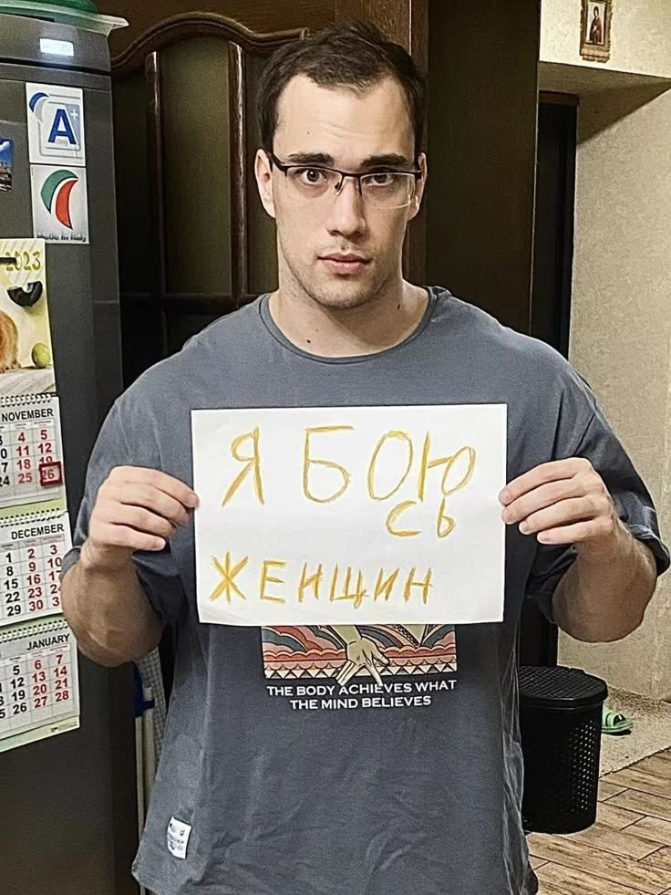

  

<h1 align="center">
  
</h1>

  

  

---

### 🛠 Tech Stack

  

---

### 🖼 Gallery

  
  
  

---

### 📊 GitHub Stats

  

  

  

---

### 📈 Activity Graph

  

---

### 🤝 Connect with me

  

  <b>Telegram: <a href="https://t.me/xsati4">@xsati4</a></b>

